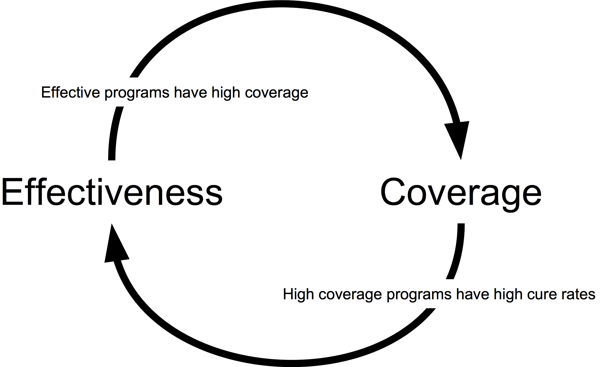
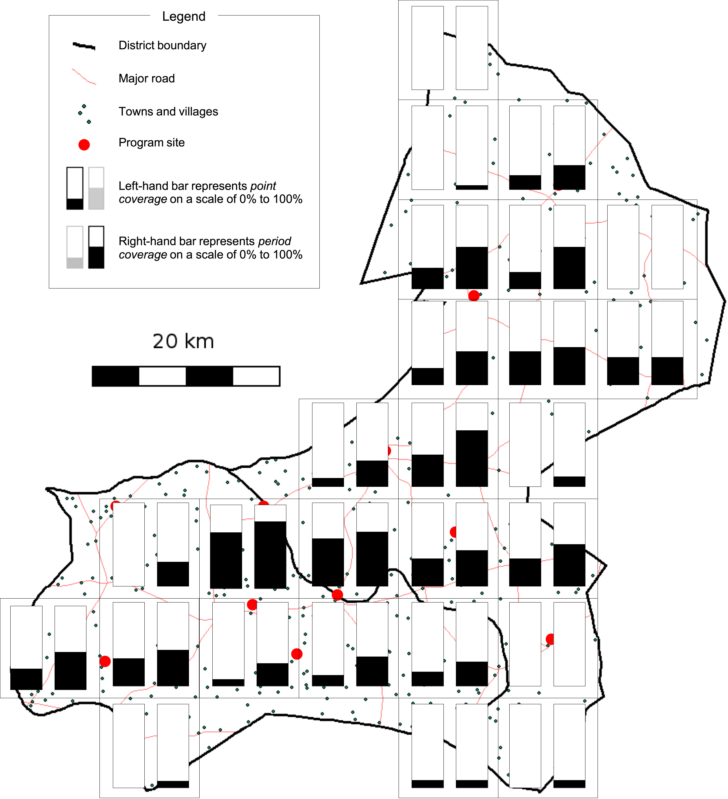
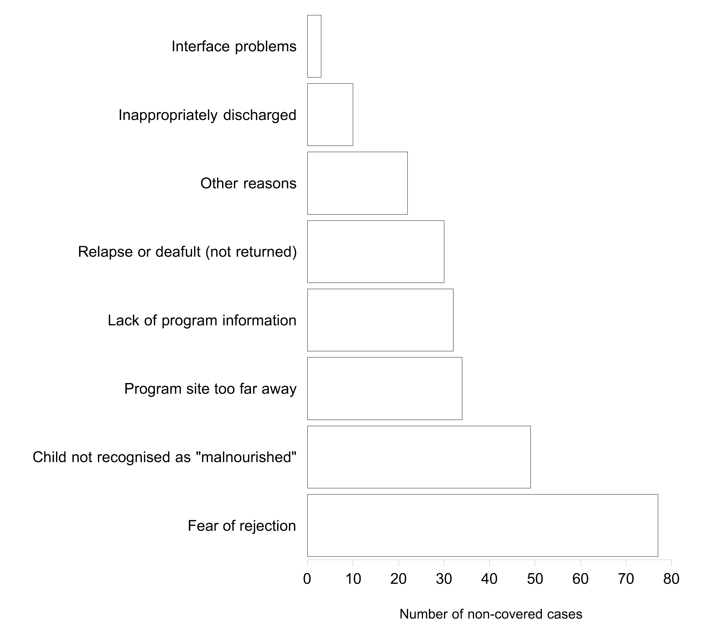
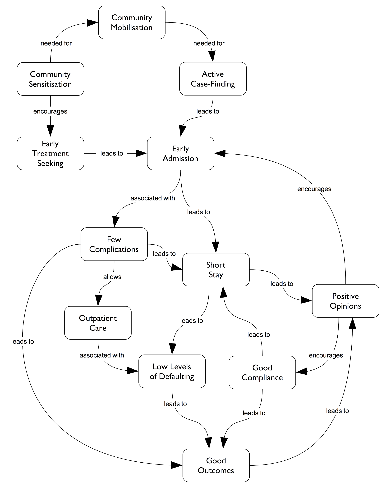

```{r setup, include = FALSE}
options(htmltools.dir.version = FALSE)
```

```{r xaringan-themer, include = FALSE}
library(xaringanthemer)
mono_light(
  base_color = "#002147",
  title_slide_background_image = "https://www.validnutrition.org/wp-content/uploads/2017/07/Valid-Nutrition-CMAM.jpg",
  title_slide_background_size = "cover",
  header_font_google = google_font("Fira Sans"),
  text_font_google   = google_font("Fira Sans Condensed"),
  code_font_google   = google_font("Fira Mono"),
  text_slide_number_font_size = "0.5em"
)
```

class: inverse, right, bottom

# Ernest Guevarra
### ernest@guevarra.io
### `r Sys.Date()`

---
# Outline

* What is coverage?

* Why is coverage important?

* Measuring coverage

* Coverage challenges

---
class: inverse, center, middle

# What is coverage?

---

class: center, middle

# Think of words or phrases that come to mind when you read or hear the term **coverage**

---
class: center, middle

$$\text{coverage} ~ = ~ \frac{\text{No. in the programme}}{\text{No. who should be in programme}}$$

---
class: center, middle, inverse

# Coverage and CMAM

---
# Coverage estimators - old

$\text{Point coverage} ~ = ~ \frac{C_{in}}{C_{in} ~ + ~ C_{out}}$

$\text{Period coverage} ~ = ~ \frac{C_{in} ~ + ~ R_{in}}{C_{in} ~ + ~ C_{out} ~ + ~ R_{in}}$

where:

$C_{in} ~ = ~ \text{cases in the programme}$

$C_{out} ~ = ~  \text{cases not in the programme}$

$R_{in} ~ = ~ \text{recovering cases in the programme}$

---

# Characteristics of estimators

* **Point coverage** assesses the programme's case-finding capabilities

* **Period coverage** assesses the programme's case-finding capabilities and its ability to retain a case from admission to cure. Always equal to or higher than point coverage (never lower)

* Period coverage more closely approximates treatment coverage or effective coverage

---
# Bias and limitations of estimators

* Both estimators are unable to detect **cases who have died** and **recovering cases not in the programme**

* **Point coverage** can underestimate true coverage in settings where **case prevalence is low** and **majority of cases are in recovery**

* **Period coverage** can overestimate true coverage in settings where **length of stay** in programme is **prolonged**

---

# Which estimators to use?

* **Early days of CMAM:** reported both point and period coverage estimators

* **Recent past:** recommendation has been made to report *only one* of the coverage estimators with the choice of estimator to report to be based on programme features such as length of stay and MUAC at admission among others

---

# Coverage estimators - updated

$\text{Case-finding effectiveness} ~ = ~ \frac{C_{in}}{C_{in} ~ + ~ C_{out}}$

$\text{Treatment coverage} ~ = ~ \frac{C_{in} ~ + ~ C_{out}}{C_{in} ~ + ~ C_{out} ~ + ~ R_{in} ~ + ~ R_{out}}$

where:

$C_{in} ~ = ~ \text{cases in the programme}$

$C_{out} ~ = ~  \text{cases not in the programme}$

$R_{in} ~ = ~ \text{recovering cases in the programme}$

$R_{out} ~ = ~ \text{recovering cases not in the programme}$

---

# What estimators to use?

* We now recommend that *both* estimators be reported as they describe different aspects of the programme relevant to coverage.

* **Case-finding effectiveness** gives an idea of how good the programme is in case-finding – a key factor in coverage

* **Treatment coverage** provides an approximation of true coverage or effective coverage

---
class: inverse, center, middle

# Why coverage?

---

# Effective CMAM meets needs

* **Efficacy** of CMAM - cure rate in ideal and controlled settings - is near 100%

* **Effectiveness** of CMAM - cure rate in programme conditions - still room for improvement

* Effectiveness depends on:

    1. Thorough case-finding and early treatment-seeking;
    
    2. High-level of compliance; and,
    
    3. Good retention from admission to cure.

---

# High coverage CMAM meets needs

* **Coverage** of CMAM – the proportion of all children eligible to receive CMAM who actually receive it – contributes to effectiveness as well

* Coverage directly depends on:

    1. Thorough case-finding and early treatment-seeking; and, 
    2. Good retention from admission to cure. 
    
* It also indirectly depends on **compliance**.

---
background-color: #FFFFFF

.center[]

**Meeting needs require both high effectiveness and high coverage**
  
  * Good coverage supports good effectiveness
  * Good effectiveness supports good coverage
  * Maximising coverage maximises effectiveness and met need
  
---
class: inverse, center, middle

### $$\text{Met need} ~ = ~ \text{effectiveness} ~ \times ~ \text{coverage}$$

---
background-image: url(figures/coverage2.png)
background-size: contain

---
background-image: url(figures/coverage3.png)
background-size: contain

---
class: inverse, center, middle

# How to meausre coverage?

---

# Indirect estimation of coverage

$$\text{coverage} ~ = ~ \frac{\text{Total cases admitted in programme}}{\text{Estimated number of cases}}$$

* **Numerator** is based on programme data
* **Denominator** is a caseload estimation based on total population in programme area and known prevalence estimate and known incidence

* Issues mainly stem from estimation of denominator

---

# Direct estimation of coverage

* Coverage estimation through a survey.

* Old approach: include coverage indicator in nutrition surveys that assess prevalence of undernutrition (SMART surveys)

* Issues with old approach: sample size

* Current approaches: surveys specifically assessing coverage

---

# History of methods development

* Coverage and its assessment was an integral component of the development process of CMAM (then called CTC)

* **Centric Systematic Area Sampling (CSAS)** was the first coverage assessment method developed

* However, **CSAS** was not as commonly used as it was deemed too costly and hard to implement

---

# History of methods development

* **SQUEAC** and **SLEAC** were then developed as quick and easy (hence less costly) methods to assess coverage

* **SQUEAC** and to some extent **SLEAC** now widely used and considered the standard, off-the-shelf methods

* With CMAM programmes getting scaled up to national scope, a wide area/large scale method such as **S3M** has been recently developed 

---

# CSAS: Design

* **CSAS** uses a two-stage sampling design

* The first stage is a **systematic spatial sample** of the entire service area to select the communities to survey. 

* The second stage is an **active and adaptive case-finding method** that finds all or nearly all cases in the communities being surveyed.

---

# CSAS: Results

* Overall coverage estimate

* Local coverage estimates which can be represented as a coverage map

* Ranked list of barriers

---
background-color: #FFFFFF

# CSAS: Results

.pull-left[
  Coverage map produced by CSAS surveys
  ]

.pull-right[
  Ranked list of barriers from a CSAS survey
  ]

---

# SQUEAC: Design

* **Semi-quantitative Evaluation of Access and Coverage** or **SQUEAC** is more an investigation than a survey

* **Stage 1:** Semi-quantitative investigation into factors affecting coverage using the **SQUEAC** toolkit, which is a set of simple and rapid tools and methods for collecting and analysing data related to coverage.

* **Stage 2:** Confirm areas of high and low coverage and other hypotheses relating to coverage identified in stage 1 through small studies, small surveys, and small-area surveys.

* **Stage 3:** Estimate overall coverage using Bayesian techniques. A likelihood survey is conducted as part of this stage. This two-stage sampling design is the same as with all other coverage survey methods. 

    * This stage is optional. Should be done if the reporting of an overall coverage estimate is a key information requirement in addition to the rich information on barriers and boosters to coverage already gained from stages 1 and 2.

---
background-color: #FFFFFF

# SQUEAC: Results

.pull-left[
* Concept map of barriers and boosters to coverage

* Coverage map using small area surveys through a “risk mapping” approach

* Estimation of coverage proportion using Bayesian techniques
]

.pull-right[]

---

# SLEAC

* **Simplified Lot Quality Assurance Evaluation of Access and Coverage (SLEAC)** is a rapid low-resource survey method that classifies coverage at the service delivery unit (SDU) level.

* Identifies the category of coverage (e.g. **“low”**, **“moderate”** or **“high”**) achieved by the service delivery unit being assessed. 

* Relatively small sample sizes (e.g. $n ~ \geq ~ 40$) are required in order to make an accurate and reliable classification.

* Can also estimate coverage over several service delivery units and is suited to wide-area use. 

* Coverage is still classified for the individual service delivery units, then, data from individual service delivery units are combined and overall coverage for the wide area is estimated.

---

# SLEAC: Design

* First stage systematic spatial sample similar to that used in CSAS. Only small sample sizes ( $n ~ \geq ~ 40$ ) are required for each service delivery unit in which coverage is being classified. 

* Second stage sample is an active and adaptive case-finding method as with the other coverage survey methods.

---

# SLEAC: Results

* Indicator classifications

* Can be used over wide areas to provide local indicators classifications with a map and a wide area estimate

* Ranked list of barriers

---

# SLEAC: Results

.pull-left[
  Sierra Leone National Coverage Map produced by SLEAC
  
]

.pull-right[
  Northern Nigeria coverage map produced by SLEAC
  
]

---

# S3M

* **Simple spatial sampling method (S3M)** is a development of **CSAS** and uses a similar sampling design.

* The main difference is **S3M** uses a hexagonal grid (as compared to a square grid for **CSAS**).

* Hexagonal grids address the issue of unevenness of spatial sampling created by square grids particularly at scale

---

# S3M: Results

.pull-left[
  Coverage map of Wolayita Zone, Ethiopia produced by S3M
  
]

.pull-right[
  Coverage map of Wollo Zone, Ethiopia produced by S3M
  
]

---

# Coverage challenges

* Global CMAM coverage average is about 30%

* Coverage assessment fatigue (?)

    * Same barriers and boosters are being identified

    * Same low levels of coverage being achieved

    * Better to act on what the current coverage assessments are saying about coverage to try to improve things before more coverage assessments are done

* Which barriers to focus on? Is there a **‘magic bullet’**?
